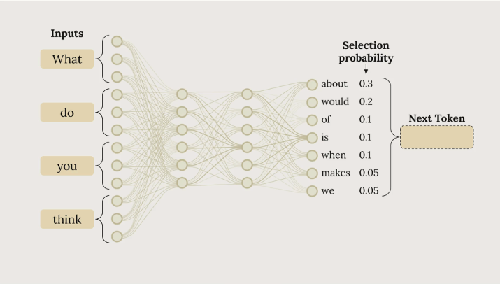

# Understanding Temperature in Claude AI

Temperature is a powerful parameter that controls how creative or deterministic Claude's responses will be. Understanding how to use it effectively can dramatically improve your AI applications.

---

## How Claude Generates Text

Before diving into temperature, it's helpful to understand Claude's text generation process.

When you send Claude a prompt like:

```text
"What do you think?"
```

Claude goes through three phases:

### 1. Tokenization

Breaking your input into smaller chunks called **tokens**.

### 2. Prediction

Calculating probabilities for possible next tokens.

### 3. Sampling

Selecting a token based on those probabilities.



# Example probability distribution:

| Token | Probability |
| ----- | ----------- |
| about | 30%         |
| would | 20%         |
| think | 15%         |
| maybe | 10%         |

This process repeats token-by-token until the response is complete.

---

# What Temperature Does

Temperature is a decimal value between `0` and `1` that directly influences token selection probabilities.

Think of it as a **creativity dial**:

* **Low temperature (near 0)**
  Makes the highest probability token much more likely to be selected.

* **High temperature (near 1)**
  Distributes probability more evenly across possible tokens.

At `temperature = 0`, Claude becomes highly deterministic and usually picks the most probable token.

At `temperature = 1`, lower-probability tokens have a much better chance of being selected, producing more diverse and creative outputs.

---

# Temperature Ranges and Use Cases

Different tasks benefit from different temperature settings.

## Low Temperature (0.0 – 0.3)

Best for:

* Factual responses
* Coding assistance
* Data extraction
* Content moderation
* Structured outputs

Example:

```json
{
  "temperature": 0.1
}
```

---

## Medium Temperature (0.4 – 0.7)

Best for:

* Summarization
* Educational content
* Problem-solving
* Balanced creativity
* Creative writing with constraints

Example:

```json
{
  "temperature": 0.5
}
```

---

## High Temperature (0.8 – 1.0)

Best for:

* Brainstorming
* Creative writing
* Marketing copy
* Storytelling
* Joke generation

Example:

```json
{
  "temperature": 0.9
}
```

---

# Setting Temperature in Code

By default, Claude's temperature is set to `1.0`, which allows for maximum creativity.

You can override this by adding the `temperature` parameter to your inference configuration.

## Python Example

``` python
def chat(messages, system=None, temperature=1.0):
    params = {
        "modelId": model_id,
        "messages": messages,
        "inferenceConfig": {"temperature": temperature},
    }

    if system:
        params["system"] = [{"text": system}]

    response = client.converse(**params)

    return response["output"]["message"]["content"][0]["text"]
```

---

# Choosing the Right Temperature

| Goal                       | Recommended Temperature |
| -------------------------- | ----------------------- |
| Precise & reliable answers | 0.0 – 0.3               |
| Balanced responses         | 0.4 – 0.7               |
| Creative & varied outputs  | 0.8 – 1.0               |

---

# Best Practices

* Start with `0.2` for technical tasks.
* Use `0.7` for general conversational AI.
* Increase temperature gradually for creative tasks.
* Combine low temperature with structured prompting for consistent outputs.
* Avoid extremely high temperatures when accuracy matters.

---
# Key Takeaways
  Temperature gives you direct control over Claude's creativity level. Use `lower temperatures when you need consistent, factual responses, and higher temperatures when you want creative`, varied outputs. The default temperature of 1.0 maximizes creativity, so consider lowering it for tasks requiring precision and consistency.


# Final Thoughts

Temperature is one of the most important controls in language model behavior.

By adjusting it carefully, you can fine-tune Claude to behave more like:

* A precise assistant
* A balanced collaborator
* A creative brainstorming partner

Experiment with different values to discover what works best for your application.
